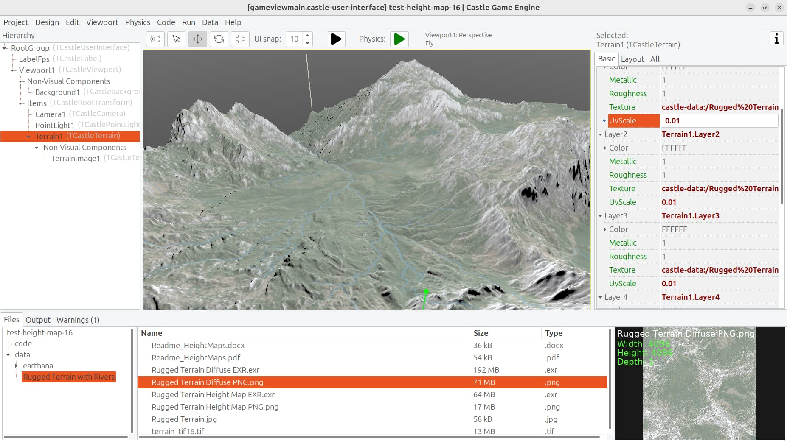
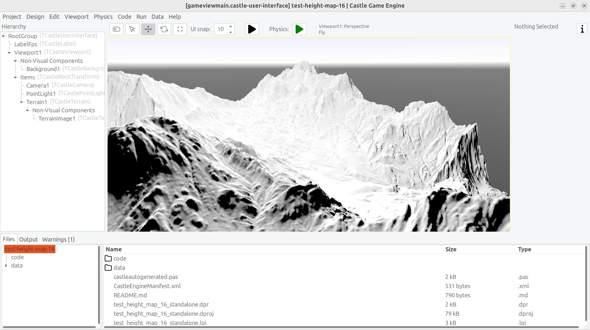
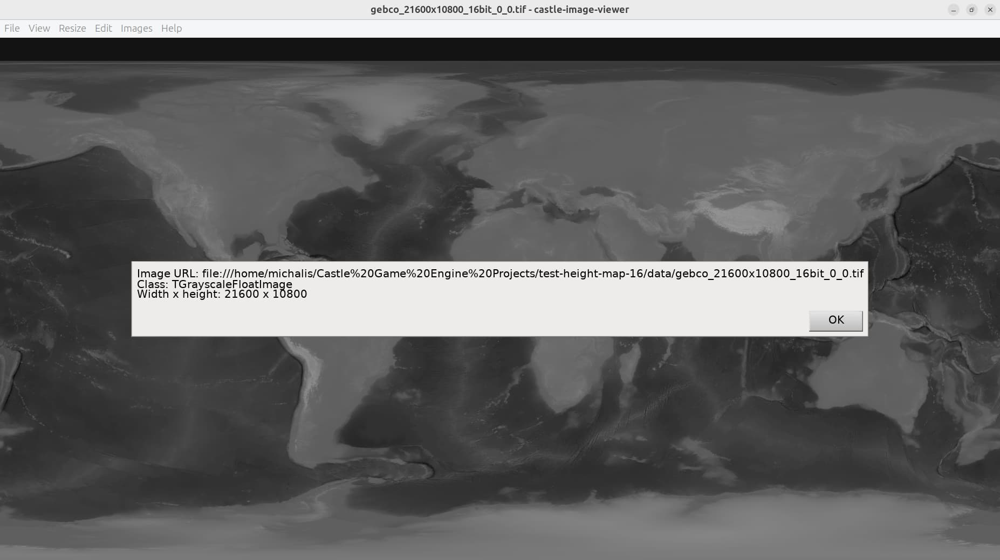

# Test loading terrains from 16-bit and higher precision image formats

We added to CGE capability to read 16-bit and higher precision image formats:

- 16-bit PNG images can be loaded to float-based image formats: `TGrayscaleFloatImage`, `TRGBFloatImage`, `TRGBAlphaFloatImage`.

    This happens both when PNG are read using `LibPng` (default) (TODO) and Vampyre Imaging Library (fallback).

- Same goes for 16/32-bit TIFF images.

    Note that you have to enable TIFF support in your application and distribute the TIFF library (libtiff) with your application. See

    - https://github.com/castle-engine/castle-engine/blob/master/doc/miscellaneous_notes/additional_image_formats.md for details how to do it.

    - https://github.com/castle-engine/castle-image-viewer branch `extra-image-formats` for working example doing it.

- New float-based image formats `TGrayscaleFloatImage`, `TRGBAlphaFloatImage`.

    The float-based image formats (both 2 new formats, and 1 old format `TRGBFloatImage`) are also uploaded to GPU as float textures, thus could be used to process this data on GPU in shaders.

This example contains some terrains designed using this feature.

This example also contains some testing TIFF images. Remember that you will not open them with default CGE editor or castle-image-viewer:

- for CGE editor, you need to follow the above instructions to get custom build with libtiff support.

- for castle-image-viewer, you can compile it from the `extra-image-formats` branch mentioned above.

See https://forum.castle-engine.io/t/request-for-tif-support/1240/26 for forum thread that initiated this.

## Screenshots

## Thank you

Thanks go to _Erik Johnson_ for supporting Castle Game Engine development, both on Patreon and by actually using the engine to develop new projects, and providing a ton of useful feedback on our forum!

The sample data has been provided by:

- [Landscape Height Maps](https://www.motionforgepictures.com/height-maps/) - great detailed terrains, including 16-bit PNG images.

- https://sbcode.net/topoearth/gebco-heightmap-21600x10800/ - big 16-bit TIFF image.

## License

Permissive (do what you want) BSD 3, see `LICENSE`.

This example by _Michalis Kamburelis_.

## Building

Compile by:

- [CGE editor](https://castle-engine.io/editor). Just use menu items _"Compile"_ or _"Compile And Run"_.

- Or use [CGE command-line build tool](https://castle-engine.io/build_tool). Run `castle-engine compile` in this directory.

- Or use [Lazarus](https://www.lazarus-ide.org/). Open in Lazarus `test_height_map_16_standalone.lpi` file and compile / run from Lazarus. Make sure to first register [CGE Lazarus packages](https://castle-engine.io/lazarus).

- Or use [Delphi](https://www.embarcadero.com/products/Delphi). Open in Delphi `test_height_map_16_standalone.dproj` file and compile / run from Delphi. See [CGE and Delphi](https://castle-engine.io/delphi) documentation for details.